# Redesign de Interface R&R Assistência Técnica

   

 Figura 1 - Logo da R&R Assistência Técnica

# Visão Geral

## O Desafio

O principal desafio do projeto é dar continuidade a uma fase já pré-pronta, evoluindo-a para um estágio de desenvolvimento completo e funcional, com foco em melhorias que aumentem a usabilidade e a satisfação do cliente.

### Refinar os Requisitos

- Realizar uma análsie detalhada das necessidades e especificações atuais.
- Garantir que as funcionalidades essenciais sejam entregues com excelência.
- Traduzir os requisitos de alto nível em especificações técnicas mais detalhadas, facilitando o entendimento da equipe de desenvolvimento.

### Aprimorar o Protótipo

- Atualizar o protótipo para refletir as especificações detalhadas e os requisitos revisados.
- Validar o protótipo com base nos casos de teste.
- Garantir que o sistema atenda aos padrões de usabilidade e às funcionalidades esperadas pelo usuário final.
- Incorporar feedbacks dos stakeholders e aplicar os conhecimentos adquiridos em IHC (Interação Humano-Computador).

### Garantir a Evolução do Projeto

- Planejar cuidadosamente as próximas etapas do desenvolvimento.
- Realizar uma modelagem clara e precisa dos requisitos.
- Assegurar que a implementação e a avaliação final pelo usuário sejam bem-sucedidas.

### Resumo:

O foco é realizar análises precisas e contínuas para aprimorar o projeto, elevando-o para próxima fase, que consiste no desenvolvimento completo do sistema.

## Contexto

Atualmente a R&R Assistência Técnica possui um software de gerenciamento de notas para realizar a emissão de notas de serviços e garantia para os serviços feitos pelo técnico da loja. Entretanto, este software está defasado por não ter uma manutenção correta e por possuir um design bem antigo, além de diversas funções existentes nele que não são utilizadas.
Percebemos que poderiam ser feitas melhorias tanto na parte visual, quanto na parte da reformulação do sistema como um todo. Simplificando e retirando tudo aquilo que não é utilizável e deixando o que de fato é utilizado de forma mais organizada e intuitiva.

# Ciclo de vida

## Estrela

O modelo de ciclo de vida estrela destaca-se pela realização de avaliações contínuas ao final de cada etapa concluída. Por ser altamente interativo e centrado no usuário, ele se alinhou bem ao desenvolvimento ágil que utilizamos. Uma de suas principais vantagens é a possibilidade de obter feedbacks ao longo do processo, permitindo ajustes e melhorias durante a construção do projeto. Como se trata de um modelo baseado em redesign, foi necessário realizar diversas adaptações e inovações, e a aplicação desse ciclo de vida mostrou-se essencial para compreender e atender às preferências dos usuários.

   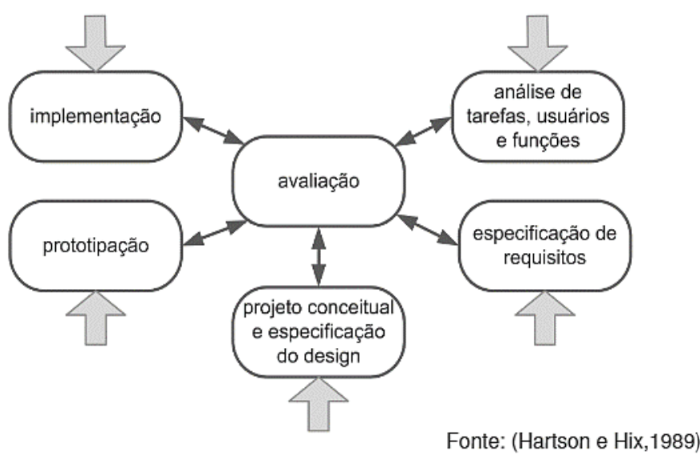

 Figura 2 - Ciclo de vida - Estrela

# WHY?

## Quem utilizará o sistema

No primeiro momento, o primeiro membro da equipe a ser product owner, entrou em contato com a empresa oferecendo o nosso serviço de Design. Houve então uma reunião com o dono da empresa, ele nos encaminhou para a secretária, que é a pessoa que utiliza o software. Com isso ela nos apresentou o programa e quais eram as dificuldades e as insatisfações.

## Quais seriam os problemas?

- Interface muito antiga, tendo como forma de manuseio, somente o teclado;
- Programa com cores que não combinam com a empresa;
- Funções obsoletas, procedimentos com pouca intuitividade;
- Por ter uma interface pouco intuitiva, os procedimentos demandam mais tempo para serem concluídos.

## Descrição do Cenário e Interação Atual

Atualmente, o projeto encontra-se na fase em que o protótipo foi aceito e testado pela usuária, atendendo às funcionalidades e aos requisitos de alto nível previamente definidos. O protótipo, em seu estado atual, contempla as seguintes demandas:

### Interface Moderna e Intuitiva:

A interface foi reformulada, apresentando um visual mais moderno em relação à versão anterior utilizada pela empresa. As cores foram ajustadas conforme as preferências da cliente, e a navegação foi desenvolvida para ser direta e objetiva. Também foi incluída a possibilidade de navegação por meio do mouse, oferecendo maior acessibilidade.

### Novas Funcionalidades Adicionadas:

- Gestão de Itens em Estoque: Adição de um módulo para controle de estoque.
- Estatísticas de Serviços: Inclusão de relatórios estatísticos para acompanhamento dos serviços prestados.
- Agenda Integrada: Implementação de uma agenda com integração ao Google Agenda, facilitando o agendamento e controle de serviços preventivos.

### Geração de Notas de Serviço

A funcionalidade foi simplificada e aprimorada com recursos adicionais:

- Geração de PDF da nota.
- Visualização em tempo real da nota sendo preenchida.
- Documento da ordem de serviço reposicionado, agora mais centralizado e organizado conforme o padrão interno da empresa.

### Página de Serviços

Nesta seção será possível: Selecionar um cliente e exibir um relatório com todos os serviços realizados anteriormente para aquele cliente (histórico de notas de serviço).

## Storytelling

“Há alguns meses a Vanilda Lima, secretária e a responsável por administrar a loja R&R Assistência Técnica, começou a perceber que os lugares em que ela frequentava, grande parte das lojas e oficinas utilizam de softwares para facilitar o gerenciamento da loja e emissão de notas. Ela percebeu também que aqueles softwares pareciam ter sido feitos de formas mais condizentes às necessidades das empresas e de forma específica, o que não era o seu caso, visto que o software utilizado na loja é genérico . Sendo assim, pensando na flexibilidade e organização de seu local de trabalho, sentiu-se a vontade de ter um programa que fizesse realmente aquilo que ela precisa, pois facilitaria ainda mais a sua vida.

Com o tempo, ela passou a pensar mais na possibilidade de automatizar processos na loja para facilitar a administração. Observando o avanço tecnológico centrado ao usuário e a rapidez com que o tempo parece passar, percebeu que precisava otimizar seu tempo para outras tarefas. Seu desejo era usar a tecnologia para organizar a loja de forma mais eficiente, aumentando sua produtividade.

Em um certo dia, houve a oportunidade da equipe Maycosoft chegar até a Vanilda e através de uma reunião com os membros ela percebeu a oportunidade passando em sua porta. Através de uma conversa, apresentamos um projeto para solucionar aqueles problemas na qual ela enfrentava. Era imprescindível, a princípio, compreender os requisitos e conhecer o programa que ela vinha utilizando para entender o seu funcionamento, a fim de propor uma solução.

Após analisar o programa, percebemos que, além de ter uma interface antiga, continha várias funcionalidades desnecessárias e ainda era escasso de recursos importantes para o gerenciamento da loja. Identificamos a necessidade de simplificar o software, atualizar a interface e desenvolver, junto com ela, as funcionalidades desejadas.

Por fim, como todas as histórias, conseguimos chegar a um acordo e encontrar uma solução para aqueles problemas. Reformulamos os caminhos de cada funcionalidade, retiramos tudo aquilo que não fazia parte do gerenciamento, daquela empresa em específico, e criamos uma interface mais intuitiva com as cores desejadas pela secretária, que era seguindo as cores da logomarca da empresa.

De frustração a eficiência e intuitividade, tentando ao máximo gerar uma boa experiência ao usuário, criamos o projeto e apresentamos a empresa cliente. Eles ficaram satisfeitos com os resultados e aguardam ansiosamente a implementação. Essa experiência mostra que reformular um sistema que não atende bem às necessidades do cliente, focando na usabilidade, pode gerar maior satisfação e conforto.”

# WHO?

## Persona

Com base nas hipóteses, storytelling e pesquisa com o usuário, nós criamos a persona para representar a secretária que irá utilizar do produto modificado:

   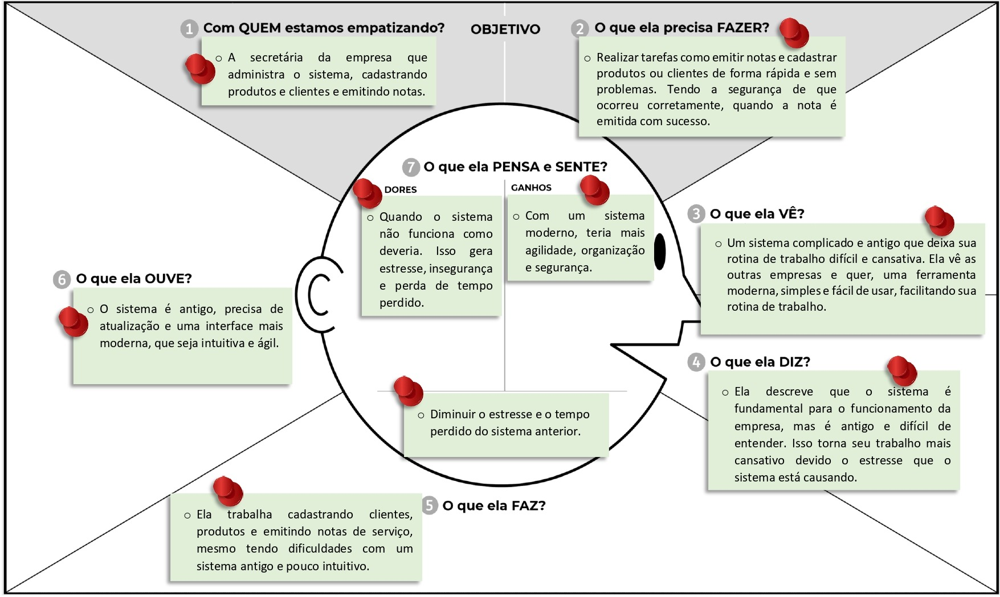

 Figura 2 - Persona

## Mapa de Empatia

Na intenção de entender as necessidades e as perspectivas da nossa cliente, se colocando no lugar dela, foi desenvolvido em sala de aula um mapa de empatia considerando a persona que foi criada.

   

 Figura 3 - Mapa de Empatia

## Avaliação - Análise de tarefa, usuários e função

### Análise de tarefas

Para identificar as tarefas que os usuários do sistema precisariam realizar, foram analisadas todas as reuniões realizadas anteriormente, as quais ocorreram de forma presencial. A validação dos requisitos, por meio da apresentação do protótipo, foi conduzida em conjunto com os stakeholders. Inicialmente, foram apresentadas as sugestões propostas pelo cliente, porém também foram sugeridas algumas melhorias e novas funcionalidades, com o objetivo de aprimorar ainda mais a experiência do usuário.

A utilização do protótipo foi essencial para compreender de forma mais clara as necessidades dos usuários, visto que, ao visualizar na prática o funcionamento do sistema, foi possível obter uma melhor compreensão tanto para os usuários quanto para a equipe de desenvolvimento. Além disso, os diagramas de modelagem foram fundamentais para oferecer uma visão abrangente das funcionalidades, auxiliando na compreensão e no desenvolvimento do sistema.

### Usuário

Após a realização de algumas análises, com base nas avaliações do nosso usuário final, foi possível compreender ainda melhor o seu perfil. Dessa forma, foi possível atualizar a persona e o mapa de empatia. Essa atualização também foi apresentada ao usuário, que a validou de forma positiva. Esse processo foi fundamental para que a equipe entendesse, de maneira mais precisa, as necessidades e expectativas do usuário, tornando o design do sistema ainda mais centrado no usuário.

### Função

Foram realizadas análises das funções, a fim de definir de forma clara quais ações o usuário irá executar dentro do sistema. O objetivo principal do sistema foi determinante para que a equipe direcionasse ainda mais foco na etapa de modelagem, garantindo que não haja erros durante o desenvolvimento.

O feedback foi positivo quando a equipe apresentou as funcionalidades aprimoradas. Uma das principais queixas em relação ao sistema antigo era a complexidade para emitir uma nota de garantia, uma vez que o usuário precisava seguir vários passos até alcançar o objetivo final. Com isso, a equipe dedicou esforços para tornar esse processo o mais simples e intuitivo possível.

### Conclusão

Realizar essa avaliação de forma individual em cada uma das etapas foi essencial para obter uma compreensão mais precisa das necessidades do usuário. Todas as validações realizadas foram fundamentais para garantir que o sistema atenda às expectativas e proporcione uma experiência satisfatória ao usuário final.

# Engenharia de requisitos

## Elicitação de requisitos

A elicitação de requisitos foi realizada por meio de reuniões presenciais com os stakeholders. Inicialmente, os requisitos foram documentados em um nível voltado ao usuário, ou seja, da forma como o próprio usuário os descreveu. Esse processo é fundamental, não apenas para que a equipe compreenda as necessidades, mas também para que o próprio usuário tenha clareza sobre o que está sendo desenvolvido.

<a href="https://trello.com/c/kGPyXjU7">Requisitos a nível de usuário</a>

## Especificação de requisitos

A partir dos requisitos de alto nível levantados junto aos usuários, a equipe realizou um refinamento, transformando-os em requisitos de sistema (baixo nível). Esse detalhamento foi fundamental para garantir que os desenvolvedores tenham total clareza sobre o que deve ser implementado, evitando ambiguidades e facilitando o desenvolvimento do sistema.

<a href="https://trello.com/c/pyBce1lT">Requisitos especificados</a>

## Avaliação - Especificação de requisitos

### Validação de requisitos com o cliente

Foi realizada uma reunião para apresentação do protótipo, juntamente com suas respectivas funcionalidades, especificadas em nível de requisitos. Durante esse encontro, a equipe responsável pelo projeto conduziu uma validação criteriosa, passando por cada requisito individualmente, com o objetivo de verificar se o projeto, que já segue para a etapa de desenvolvimento, está alinhado às expectativas do cliente.

Durante a reunião, o usuário fez sugestões e observações importantes. Além disso, a própria equipe também propôs algumas melhorias percebidas durante o processo de especificação dos requisitos. A maioria das sugestões foi bem aceita pelos stakeholders, sendo devidamente registradas e documentadas para ajustes futuros.

Após a incorporação dos novos requisitos refinados e a atualização do protótipo, foi realizada uma nova apresentação ao cliente. Nessa etapa, a validação foi concluída com um feedback totalmente positivo, sinalizando que o projeto está de acordo com as necessidades e expectativas do cliente.

# Projeto conceitual e especificação do design

## Identidade Visual

A Identidade visual do sistema foi inspirada nas cores e na logomarca da R&R Assistência Técnica,com algumas adaptações criativas para harmonizar com o estilo visual desejado. A paleta de cores foi baseada nos tons característicos da empresa, mas sofreu ajustes que foram da paleta de cor roxa( Sendo essa a cor inicial ). Para a de cor azul para atender uma estética personalizada e única de acordo com o gosto do nosso cliente.

   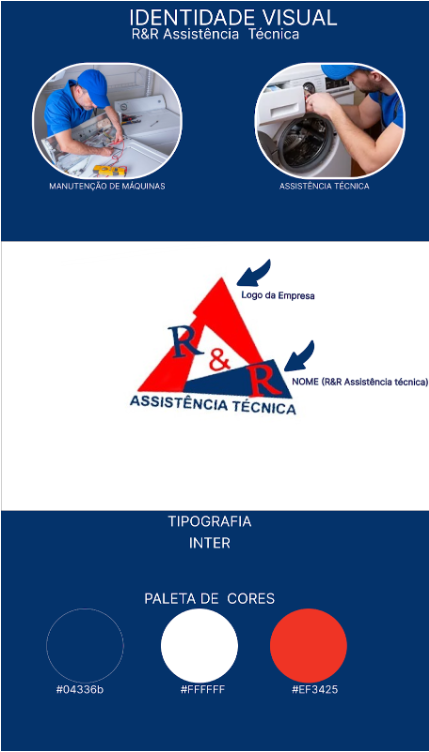

 Figura 4 - Identidade Visual

## Wireframe

Ao longo da trajetória da empresa Maycosoft, foram desenvolvidos protótipos de baixa fidelidade e de média fidelidade no (Figma), incorporando as funções essenciais do sistema. Este protótipo foi criado com foco na validação inicial do conceito e fluxo de usuário, servirá de base sólida para o desenvolvimento de um protótipo de alta fidelidade. A transição para alta fidelidade permitirá a exploração mais detalhada da interface, incluindo elementos visuais refinados, interações mais complexas e uma experiência de usuário mais imersiva com o protótipo de alta fidelidade, pretendemos testar a usabilidade em um contexto mais próximo da realidade, coletando feedback essencial para garantir uma experiência intuitiva e eficiente para os usuários finais.

A interface inicial oferece duas funcionalidades essenciais para a navegação do usuário: acesso à plataforma e registro. A funcionalidade de acesso permite que usuários cadastrados entrem em suas contas usando nome de usuário e senha. Já a funcionalidade de registro possibilita a criação de novas contas para usuários que ainda não estão cadastrados na plataforma.

Após o login bem-sucedido, o usuário acessa o painel principal, uma central de controle que disponibiliza quatro módulos funcionais: gerenciamento de clientes, catálogo de produtos, acompanhamento de pedidos.

A função de Gerenciamento de Clientes exibe uma lista completa dos clientes cadastrados. Cada cliente é representado por seu código único, nome, endereço completo, número de telefone e data do último contato. Além disso, este módulo permite o cadastro de novos clientes, facilitando a expansão da base de dados.

A seção de Catálogo de Produtos apresenta uma listagem completa, contendo o código de identificação único de cada produto, sua descrição detalhada e o respectivo preço de venda e que também permite o cadastro de novos produtos.
A área de Acompanhamento de Pedidos exibe uma lista de todas as notas de serviço emitidas, detalhando o código de cada nota, o nome do cliente associado, o status atual do pedido (pendente, em andamento, concluído), o valor total, e data de emissão. Este módulo também oferece funcionalidades para criação de novas notas de serviço.

O módulo de Calendário permite a visualização de datas em três perspectivas distintas: mensal, semanal e anual, oferecendo flexibilidade na organização e consulta de informações cronológicas,o calendário tem também a funcionalidade para ver os serviços que precisam ser feitos novamente (serviços recorrentes) .

A seção de Configurações permite o acesso ao perfil do usuário para gerenciamento de dados pessoais, às configurações de segurança da conta e às ferramentas de backup e recuperação de dados.

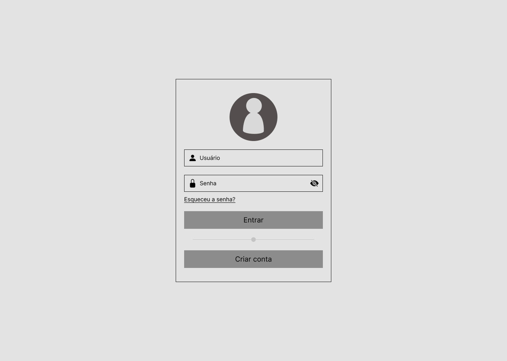

 
Figura 5 - Wireframe Login.

Essa é à tela inicial de login. Nesta tela, você precisará inserir seu nome de usuário e senha para acessar sua conta. Após inserir suas credenciais, clique no botão "Login" para prosseguir. Caso tenha esquecido sua senha, utilize a opção "Esqueci minha senha" para redefini-la. Se você ainda não possui uma conta, por favor, clique em "Criar conta".

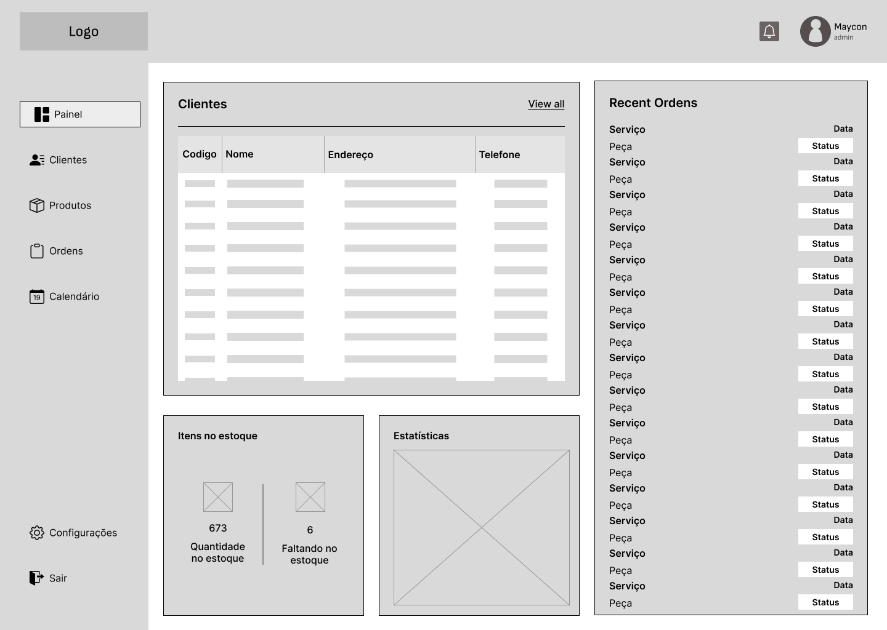

 
Figura 6 - Wireframe Dashboard.

No painel principal, você verá informações como:
Clientes: Por exemplo, o cliente com código "C001", nome "Maria Silva", telefone "(11) 99999-9999" e endereço "Rua X, 123".
Ordens recentes: Você visualizará detalhes como a ordem para o serviço,"Troca de óleo" "realizado em 15/11/2024",e quais peças foram utilizadas em cada serviço feito.
Estoque: O painel mostrará, por exemplo, que há 5 unidades do "Produto A" e 20 unidades do "Produto B" em estoque.
Estatísticas: Gráficos exibirão dados como número total de clientes, ordens concluídas no mês e valor total de vendas, por exemplo.

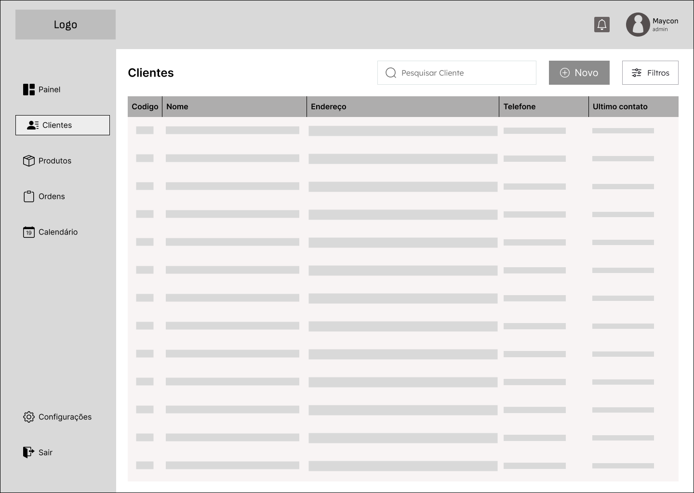

 
Figura 7 - Wireframe Clientes.

Nesta tela, você verá uma lista completa de seus clientes. Utilize a lupa para pesquisar rapidamente um cliente específico pelo nome ou código. A lista exibirá os seguintes dados para cada cliente:
Código do Cliente: Um identificador único (ex: C001, C002, etc.).
Nome do Cliente: Nome completo do cliente (ex: João da Silva).
Endereço: Endereço completo do cliente (ex: Rua dos Pinheiros, 123 - São Paulo - SP).
Telefone: Número de telefone do cliente (ex: (11) 1234-5678).
Último Contato: Data do último contato realizado com o cliente (ex: 15/11/2024).
Você também pode adicionar um novo cliente clicando no botão "Adicionar Cliente" e filtrar a lista para encontrar clientes específicos com maior facilidade, utilizando os filtros disponíveis.

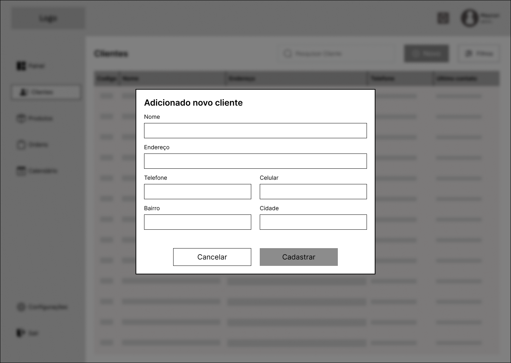

 
Figura 8 - Wireframe Novo Cliente.

Como foi citado acima em"clientes",ao clicar em "Novo Cliente", você acessará um formulário para adicionar um novo cliente ao sistema. Neste formulário, você precisará preencher os seguintes campos:
Nome: Nome completo do cliente (exemplo: Maria da Silva Santos).
Endereço: Endereço completo,(exemplo: Rua das Flores, 123, apto 201, Vila Mariana, São Paulo).
Telefone/Celular: Número de telefone ou celular do cliente (exemplo: (11) 98765-4321).
Bairro: Bairro onde o cliente reside (exemplo: Vila Mariana).
Cidade: Cidade onde o cliente reside (exemplo: São Paulo).
Após preencher todos os campos obrigatórios, clique em "Cadastrar" para salvar as informações do novo cliente.

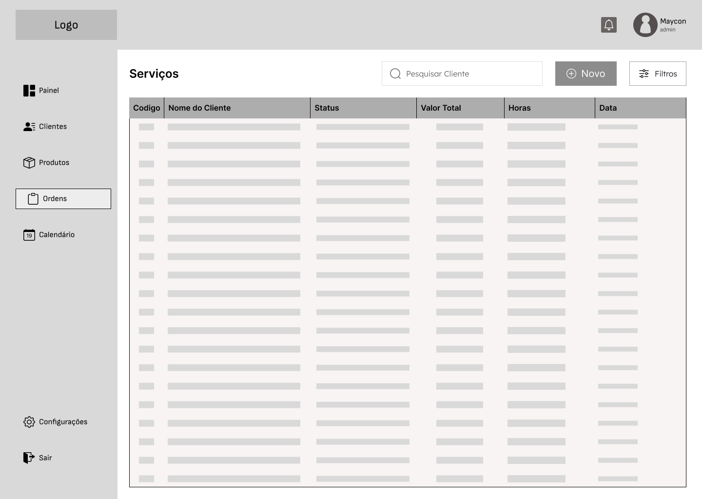

 
Figura 9 - Wireframe Serviços.

A seção "Serviços" oferece uma lista de todos os serviços prestados, com recursos de pesquisa (lupa) e filtros, similar à seção de clientes. Você pode adicionar novos serviços e filtrar a lista existente. Cada serviço exibirá os seguintes dados:
Código do Serviço: Um identificador único para cada serviço (ex: SRV001, SRV002, etc.).
Nome do Cliente: O nome do cliente que solicitou o serviço (ex: João Silva).
Status: O status atual do serviço (ex: Pendente, Em andamento, Concluído, etc.).
Valor Total: O valor total cobrado pelo serviço (ex: R$ 150,00).
Horas: Número de horas trabalhadas ou estimadas para o serviço (ex: 4 horas).
Data: Data do início ou conclusão do serviço (ex: 2024-11-16).

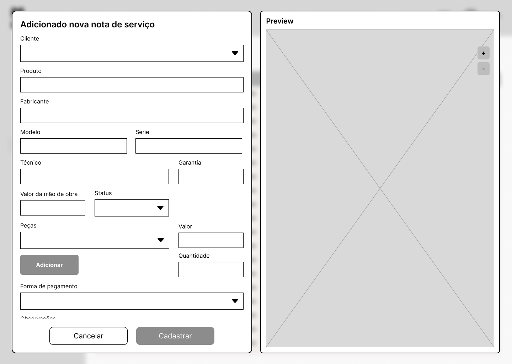

 
Figura 10 - Wireframe Novo Serviços.

Nesta seção, você adicionará novas notas de serviço. Para isso, preencha os seguintes campos:
Nome do Cliente: Selecione o cliente da lista ou adicione um novo. (Exemplo: João da Silva)
Produtos: Descrição detalhada do produto ou serviço prestado. (Exemplo: Reparo em placa-mãe de computador)
Fabricante: Fabricante do produto. (Exemplo: Dell)
Modelo: Modelo do produto. (Exemplo: Inspiron 5520)
Série: Número de série do produto, se aplicável. (Exemplo: 1234567890)
Técnico: O técnico responsável pelo serviço. (Exemplo: José da Costa)
Garantia: Informação sobre a garantia do serviço ou produto. (Exemplo: 90 dias)
Valor da Mão de Obra: Valor cobrado pela mão de obra. (Exemplo: R$ 100,00)
Status: Status atual da nota de serviço (Exemplo: Aberto, Em Andamento, Concluído)
Peças: Para cada peça utilizada, informe a descrição, valor unitário e quantidade. (Exemplo: Parafuso - R$ 2,00 - 5 unidades)
Valor Total das Peças: Valor total das peças utilizadas. (Exemplo: R$ 10,00)
Forma de Pagamento: Forma de pagamento utilizada pelo cliente. (Exemplo: Cartão de crédito)
Após preencher todos os campos, clique em "Cadastrar" para salvar a nota de serviço.

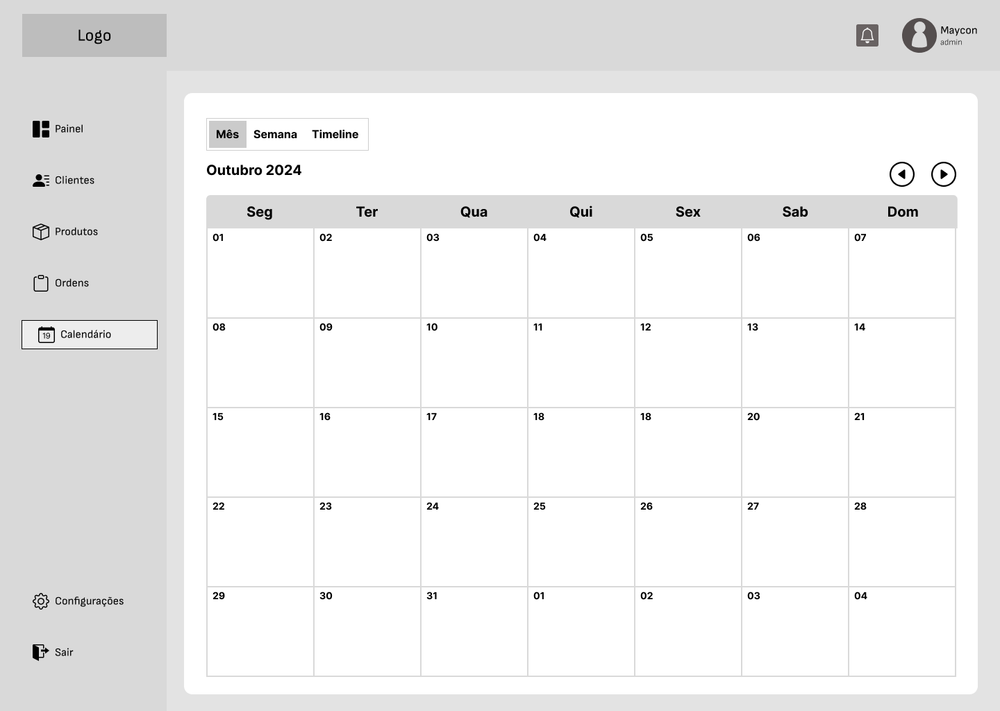

 
Figura 11 - Wireframe Calendario.

Essa sessão é do calendário que permite visualizar as datas de forma organizada, permitindo a escolha da visualização por:
Mês: Exibe todos os dias do mês selecionado, mostrando os compromissos ou eventos agendados para cada dia.
Semana: Exibe os dias da semana, facilitando a visualização dos compromissos semanais.
Ano: Oferece uma visão completa do ano, permitindo ver os compromissos distribuídos ao longo dos meses.

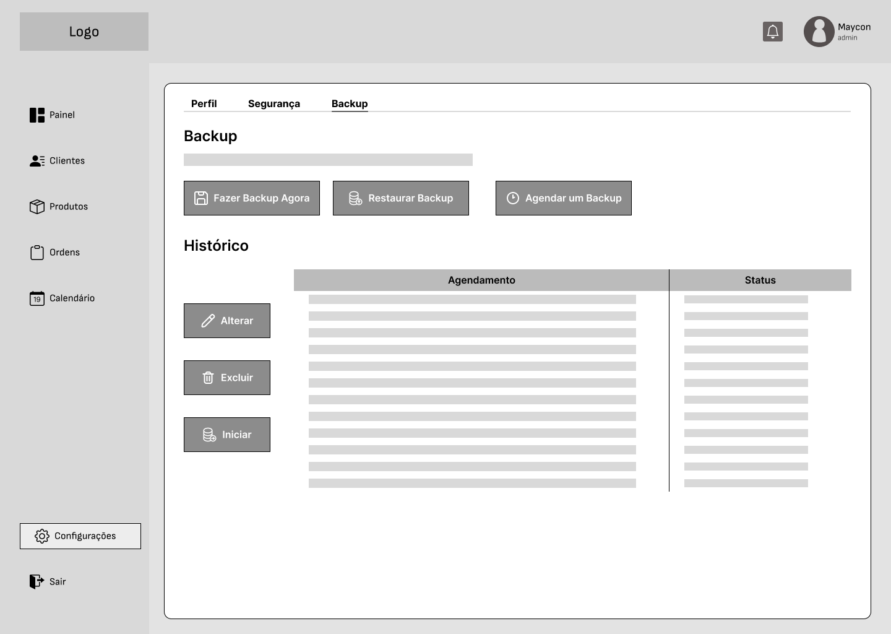

 
Figura 12 - Wireframe Backup.

Nesta tela, você gerencia os backups do sistema. Existem três botões principais:
Fazer Backup Agora: Permite executar um backup imediatamente.
Restaurar Backup: Permite restaurar o sistema a partir de um backup previamente realizado.
Agendar Backup: Permite agendar backups automáticos em intervalos regulares (diário, semanal, mensal, etc.).
Abaixo, há um histórico de backups com informações sobre cada backup realizado e para cada backup no histórico, você encontra os botões:
Alterar: Modificar a programação de um backup agendado.
Excluir: Remover um backup do histórico.
Iniciar: Iniciar um backup agendado manualmente.

## Protótipo de média fidelidade

### Interface Inicial:

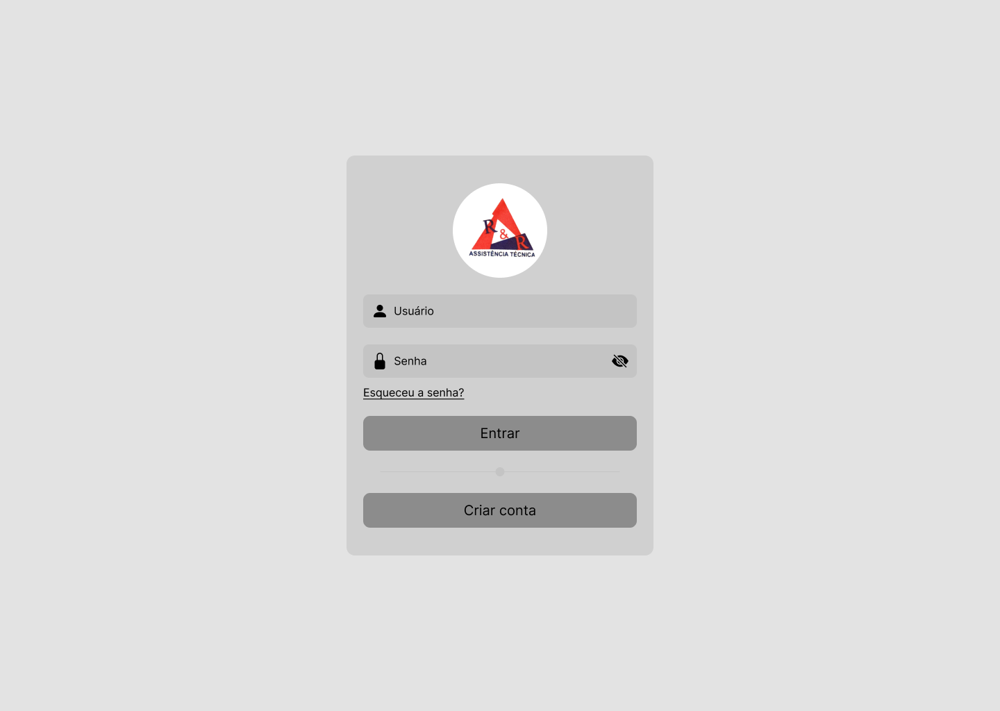

 
Figura 13 - Login.

### Interface de Dashboard:

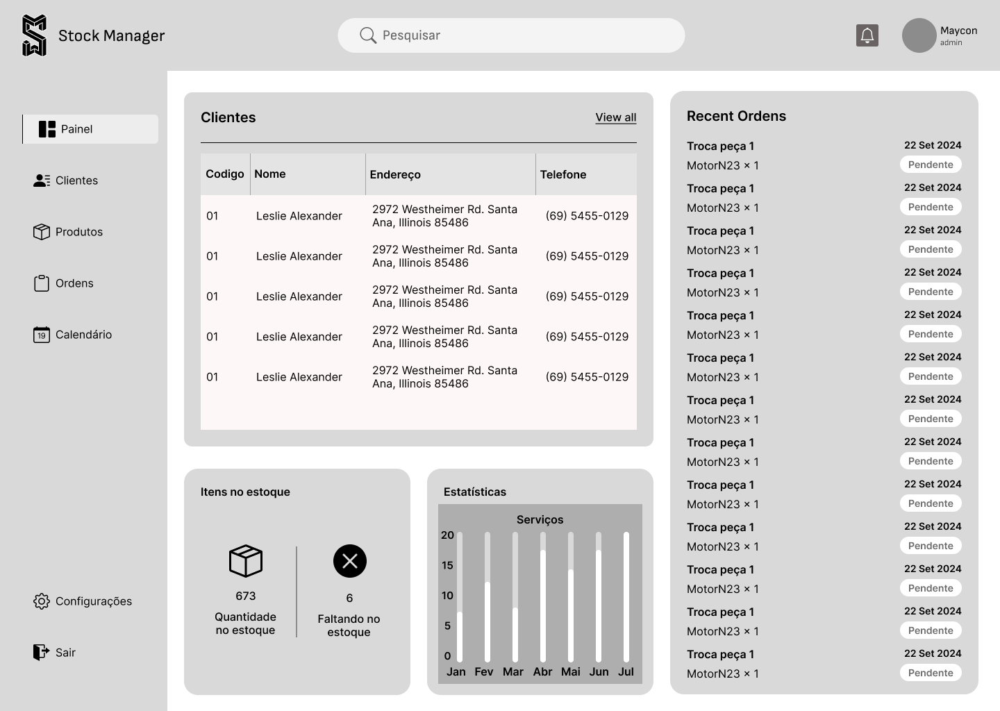

 
Figura 14 - Dashboard.

### Interface de visualização dos clientes:

   
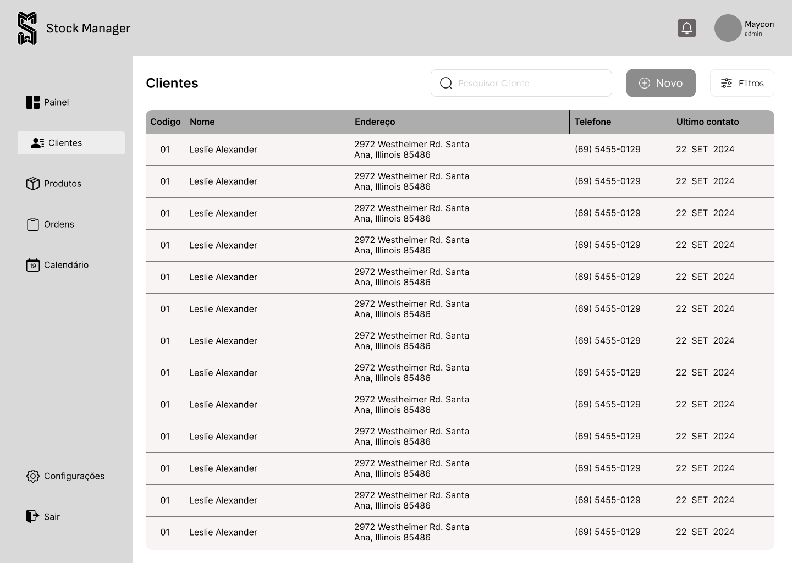

 
Figura 15 - Tela de visualização de clientes

### Interface de adição de novo cliente:

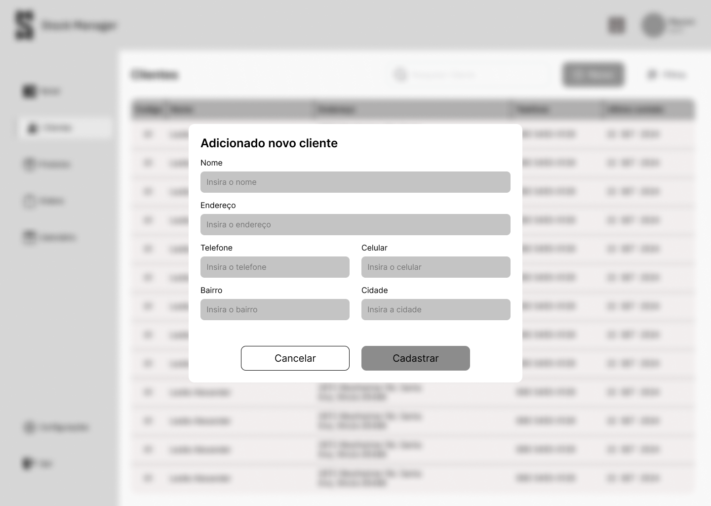

 
Figura 16 - Tela de adicionar novo cliente

### Interface de visualização de produtos:

   

 
Figura 17 - Tela de Produtos

### Interface de visualização de calendário:

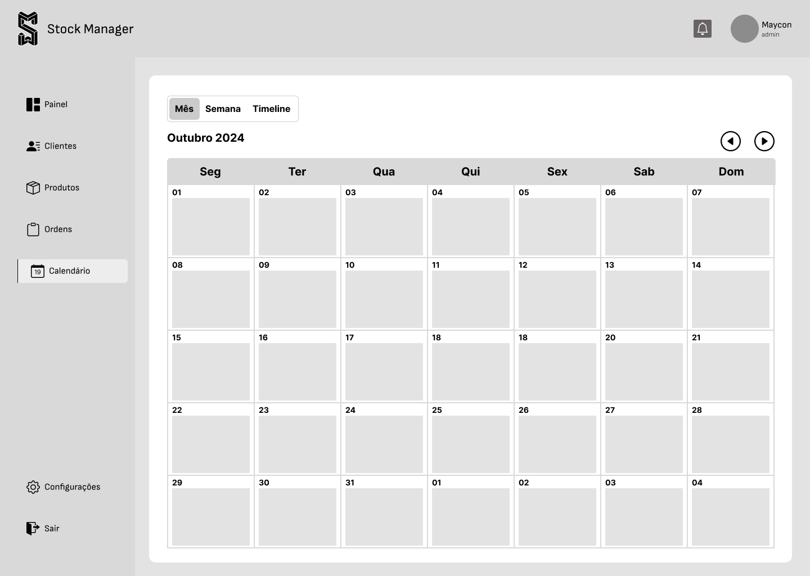

 
Figura 18 - Tela de Calendário

### Interface de nota de serviço:

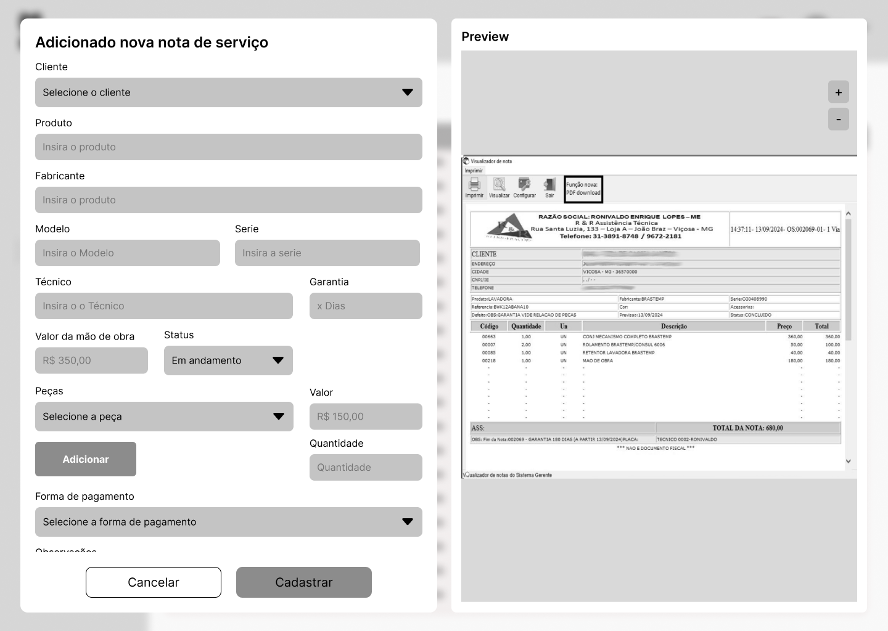

 
Figura 19 - Tela de adicionar nova nota de serviço

### Interface da tela de backup:

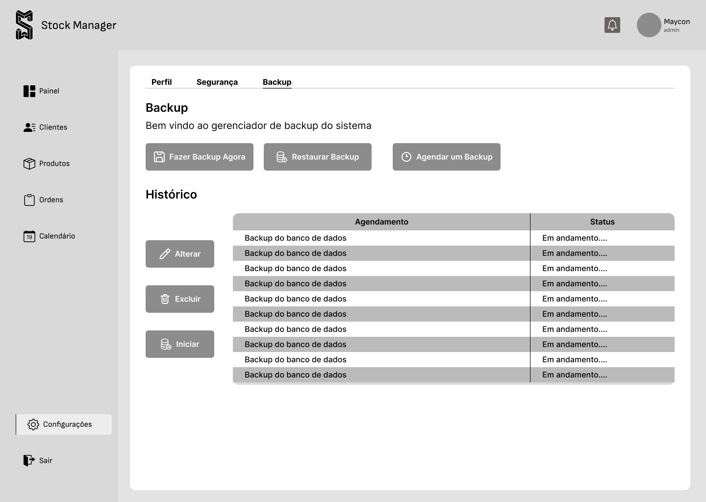

 
Figura 20 - Tela de Backup

## Protótipo de alta fidelidade

Facilita a visualização de como o sistema funcionará na prática, permitindo que ajude o cliente pensar em melhorias ou alterações antes da etapa de desenvolvimento, garantindo que todas as funções do sistema atendam às necessidades dos usuários.

**Design Visual e Layout das Telas**

Através do figma realizou-se a criação das telas de login, cadastro de produtos e clientes, listas e busca, e envio de notas, com um layout intuitivo e moderno.

<a href="https://www.figma.com/design/ralsS6FgAg8q3eQuA4uaI1/Design-R-R-2.0?node-id=472-710&p=f&t=hcnkfBuX4T07Jc0g-0" target="_blank">Protótipo de Alta Fidelidade </a>

## Processo contínuo

As sequências de ações para completar o projeto seriam:
Iniciamos o processo de refino da interface, criando telas e animações restantes para melhorar visual e usabilidade do sistema. A criação das telas faltantes e adição de animações garantem fluidez e usabilidade agradável. Testamos tudo para garantir facilidade e intuitividade de uso. Há ajustes finais, mas o progresso é substancial.

Organizamos o Trello, deixando o quadro de tarefas claro e organizado. A organização facilita o acompanhamento do projeto e seu status. Esta etapa está quase concluída.

Iremos escrever o texto que resume o projeto, destacando conquistas e resultados obtidos. O foco é clareza e demonstração do sucesso do trabalho.

Revisamos todo o texto para corrigir erros de digitação, gramática ou clareza. Buscamos um texto bem escrito e fácil de entender, livre de erros. Esta etapa de checagem está quase finalizada.

Transferimos documentos e códigos para o GitHub para facilitar o trabalho em equipe e garantir acesso aos arquivos atualizados. A transferência para o repositório está quase concluída.

<a href="https://drive.google.com/file/d/1CkTfOk3pIiZ_FXGgSiVQQI4GnXnkIZFp/view?usp=sharing"> Video Explicativo do protótipo</a>

# Avaliação do protótipo

## Avaliação parcial de requisistos e funcionalidades básicas do protótipo.

### Metologia de avaliação

Para realizar a avaliação do protótipo a equipe se reuniu e apresentou o protótipo e todas as suas funcionalidades...

## Projetos futuros

### Os próximos passo do projeto incluirão:

Nessa próxima étapa a equipe começara a desenvolver o projeto e implementar tudo conforme foi planejado no protótipo, requisitos e caso de teste.

## ✅ Conclusão

Sob a orientação da professora Cristiane Aparecida Lana, tivemos a oportunidade de finalizar a primeira parte do Projeto Integrador, no qual desenvolvemos um protótipo de um sistema para atender as demandas da R & R Assistência Técnicas (Roni & Refrigeração Assistência Técnicas). Foi uma experiência muito prática e enriquecedora, que nos permitiu vivenciar de perto os processos de design do desenvolvimento de software. O foco principal foi na etapa de prototipação, e passamos por todas as fases, desde a documentação até o design final do sistema. Trabalhamos de forma colaborativa, simulando a criação da empresa fictícia Maycosoft, o que trouxe um ambiente dinâmico e realista. Cada integrante da equipe assumiu papéis como CEO, Scrum Master, Analista de Sistemas, Product Owner e Designer, o que nos ajudou a entender melhor como cada função contribui e qual a importância de cada responsabilidade no sucesso do projeto. Essa integração nos fez enxergar na prática o valor de trabalhar juntos e o impacto de cada contribuição individual.

## 🤝 Colaboradores do projeto

<table>
  <tr>
    <td align="center">
      
       
      <b>Maycon Araújo</b> - <a href="https://github.com/M4yc" target="_blank">M4yc</a>
    </td>
    <td align="center">
      
       
      <b>Vanessa Barros</b> - <a href="https://github.com/Vanessab4rros" target="_blank">Vanessab4rros</a>
    </td>
    <td align="center">
      
       
      <b>Taís Moreira</b> - <a href="https://github.com/TaisMoreir" target="_blank">TaisMoreir</a>
    </td>
    <td align="center">
      
       
      <b>Luslene Soares</b> - <a href="https://github.com/luslene" target="_blank">luslene</a>
    </td>
    <td align="center">
      
       
      <b>Luiz Filipe Souza</b> - <a href="https://github.com/LuizFilipe16" target="_blank">LuizFilipe16</a>
    </td>
  </tr>
</table>
